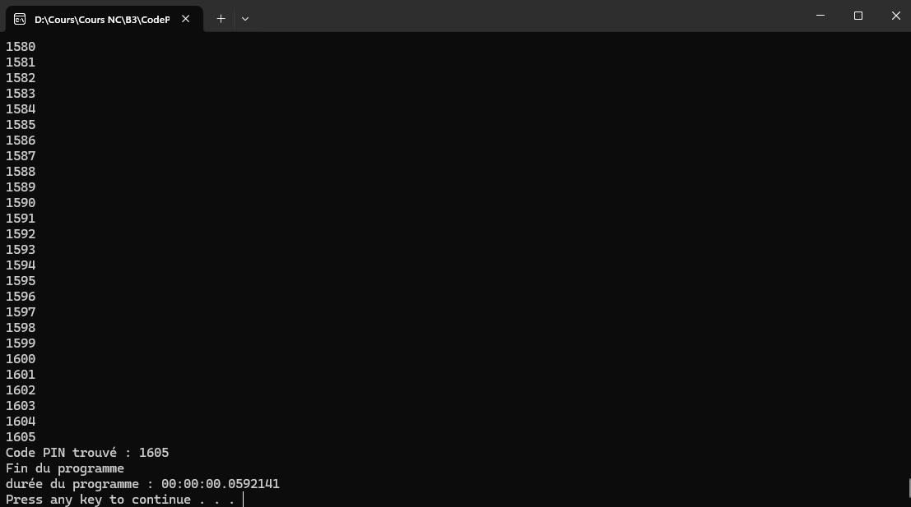

# 🔐 Casser un Code PIN 

---

### ✅ **# Quelle est la durée de ce programme en secondes ? En millisecondes (ms) ?**

* **Durée en secondes** : `0,0147277 s`
* **Durée en millisecondes** : `14,73 ms`

### 🔎 **Résultat**

---

### ⌛ **Quelle est la durée du programme en secondes ?**

* **0,0592141 secondes**

### 🔁 **Relancez le programme avec temporisation de 5ms. Quelle est sa durée ?**

* **38 secondes**

### ⏳ **Mettez maintenant une temporisation de 1 seconde (= 1 000 ms). Lancez le programme : quel est l’effet sur l’attaquant ?**

> L'effet pour l'attaquant est que **plus la temporisation est grande**, **plus il prendra de temps à trouver le code.** C'est dissuasif.

---
